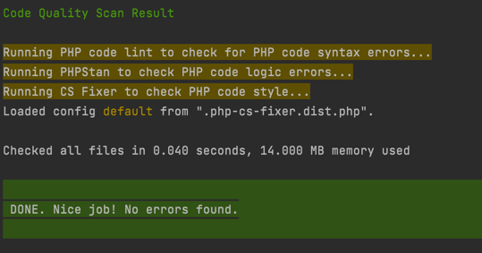
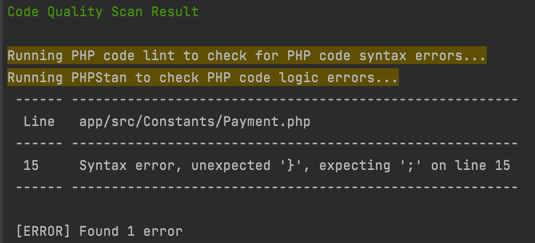

# PHP Quality Checker

- [About](#about)
- [Installation](#installation)
- [Usage](#usage)
- [FAQ](#faq)

## About

This package contains a bash script, which takes all changed files using git and handles quality scanning for these files.

Following tools are used to handle PHP code quality scanning:
- PHPStan
- PHP-CS-Fixer
- PHPLint

## Installation

1. Download the package using composer by running:

    ```shell
    composer require dslezas/php-quality-checker
    ```
   

2. Copy files from `config.dist` directory to your project root and adapt configuration files as needed.


3. Define post install script in your `composer.json` file to define git hook creation script:
   ```json
   {
      "scripts": {
         "post-install-cmd": [
            "vendor/dslezas/php-quality-checker/init_hook.sh"
         ]
      }
   }
   ```

4. Define bin directory in your `composer.json`:
   ```json
   {
      "config": {
        "bin-dir": "bin"
      }
   }
   ```

4. Run `composer install`. If everything went successfully, GIT hook was successfully created.

## Usage

1. After doing any changes in PHP files try to commit it. You should see scanning in progress:

   

2. If there are some errors, report will be shown:

   


## FAQ

- #### What if I want to commit changes without running quality check?

   - When using terminal you can add `--no-verify` option. I.e. `git commit -m "Some commit message" --no-verify`
   - When using IDE, you have to uncheck `Run Git hooks` checkmark.